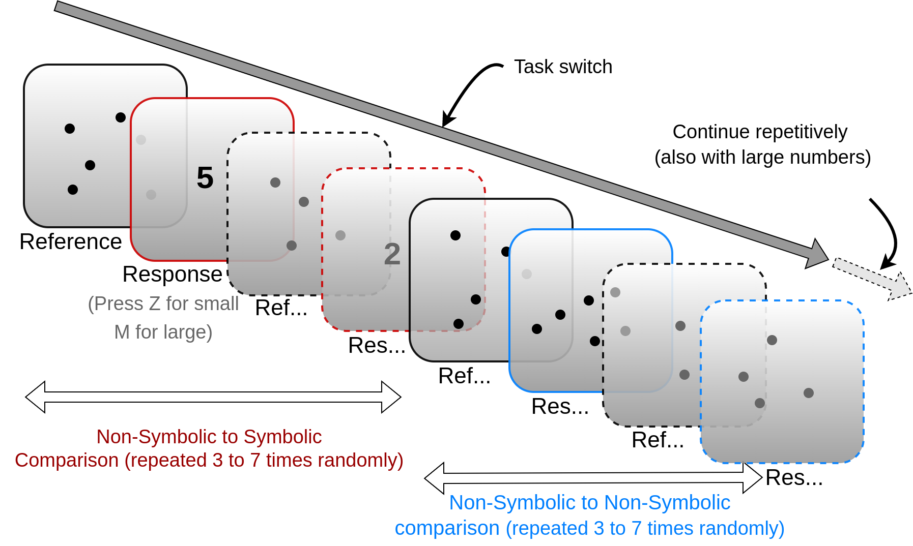

# Psychophysics Experiment on Visual Comparison of Symbolic-Nonsymbilic Numbers

*An abstract diagram depicting experimental design using psychtoolbox*

**Authors**: Bhavesh K Verma, Rakesh Sengupta

## Overview
Many animal species, including humans, have the ability to perceive numbers in non-symbolic forms, such as a certain number of objects in our visual field (Gelman and Gallistel 1986). Non-symbolic numerosity perception does not require learned understanding of numbers. Over thousands of years, humans have constructed many forms of symbolic representations of numbers, enabling us to work with even larger numbers and perform complex mathematical operations. Perception of non-symbolic numerosity in the visual field has a different Initial Neural mechanism than the number perception from symbolic visual inputs.(Tom Verguts & Wim Fias 2008) Our brain frequently switches between perception from one form of number inputs to another in our daily lives. Some of the tasks require us to translate between them, and some require us to compare their magnitudes. This experimental study attempts to measure the errors and reaction time variation while comparing numerosity perceived from symbolic and non-symbolic visual inputs. The experiment involves random interval switching from one task to another. By understanding how the errors from these two processes interact, we can better understand the neural mechanisms for number perception.

## Procedure
The experiment was conducted on a standard computer with a 1080p resolution, utilizing custom software programmed in Matlab integrated with Psychtoolbox3 for stimulus presentation and response recording. Participants were comfortably seated in a quiet, dimly lit room to minimize external distractions throughout the experiment.

During the experimental procedure, participants were sequentially presented with a series of images on the computer screen. These images were classified into two types based on their function: reference images and response images. Reference images comprised a certain quantity of black dots, denoted as non-symbolic numbers, while response images contained either a different quantity of non-symbolic numbers or a symbolic number represented in Hindu-Arabic notation.

Each trial consisted of a pair of images, starting with a reference image followed by a response image. Participants were instructed to passively observe the reference image and then respond by pressing the 'm' key if they perceived the numerosity of the response image as larger than that of the previous reference image. Alternatively, they were instructed to press the 'z' key if they perceived the numerosity of the response image as smaller. Participants were encouraged to respond promptly and accurately during the presentation of the response image.

The experiment encompassed around 1,000 trials, each involving a pair of images. The nature of the response image (symbolic or non-symbolic) alternated every Kth trial, with K randomly selected from the set: {3, 4, 5, 6, and 7}. The trials were divided into two halves, each comprising approximately 500 trials. The first half involved images with numerosities randomly chosen from the set of small numbers: {1, 2, 3, 4, 5, 6, and 7}, while the second half presented images with numerosities from the set of large numbers: {17, 20, 24, 29, 35, 41, 50, and 60}. This design allowed us to conduct the same experiment for both small and large numbers in a single session.

## Instructions to perform the experiemnt yourself

a.Install Matlab and Psychtoolbox3
b. Keep all the codes in the same directory
c. run expV002.m for experiment

To do a basic analysis:
run show_analysis1.m (after editing first two lines)

## Contact
For more details, reach out to the principal corresponding author at [bhaveshverma32@gmail.com](mailto:bhaveshverma32@gmail.com).
